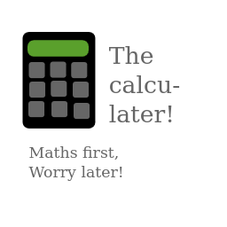

# calcu-later

Lightweight open source calculator built in python, attempting to make less disambiguities

## 💡 the idea
***You may skip this part***

When I was searching calculators on my dad's iPhone 7, to make it useful, I stumbled upon an app called "Calc84". It had some settings to reduce disambiguities like if 100 + 20% should be equal to 120 (100 + 20% of 100) or 100.2 
(literally 100 + 20/100, which is what % means. per cent means by 100, so 20 % is 20 by 100 or 0.20.) so I used 100.2 as my mathematical self liked that, and felt like only people who REALLY use the "%" button (not me!) needed it.
Then I thought, "Why don't we just solve these problems by better notation instead of a setting so that you do not have to frantically check a setting so that you get the output you want? There may be bigger disambiguities!!!"
That led me to calcu-later, so that you only worry later if it is not a setting. Still, I added some settings but only for visual problems so there is no big problem. 

